# Andrey Markov

Full-stack product engineer building practical web products, auth flows, and developer tooling.

## About

I work at the intersection of product, backend architecture, and developer experience.

## Currently focused on

- Auth and identity infrastructure
- Framework-neutral TypeScript libraries
- Nuxt and Vue developer experience
- Practical backend architecture
- Deployment and infrastructure

## Selected work

### [uniauth](https://github.com/alyldas/uniauth)

Headless identity orchestration core for TypeScript and Node.js.

Focus: users, identities, credentials, verifications, sessions, and account-linking policy.  
Built to stay independent from UI, HTTP routes, cookies, ORM choices, and hosted auth services.

### [theme-mode](https://github.com/alyldas/theme-mode)

Small color mode controller for Nuxt, Vue, and framework-neutral helpers.

Focus: explicit package entry points, predictable runtime behavior, and clean app integration.

### [topbybit](https://github.com/alyldas/topbybit)

Small Bybit market overview prototype.

Focus: top gainers and losers over 24 hours, quick market-category switching, and a lightweight interface.

## Stack

**Core**  
PHP, TypeScript, JavaScript, Node.js

**Backend**  
Laravel, Express, REST APIs, auth flows, SQL-first thinking

**Frontend**  
Nuxt, Vue, HTML, CSS

**Infra**  
Docker, Nginx, Linux, CI/CD

## Principles

- Build useful things, not resume fluff
- Prefer clarity over hype
- Keep abstractions honest
- Optimize for maintainability first

## GitHub Stats

## Contact

- GitHub: [github.com/alyldas](https://github.com/alyldas)
